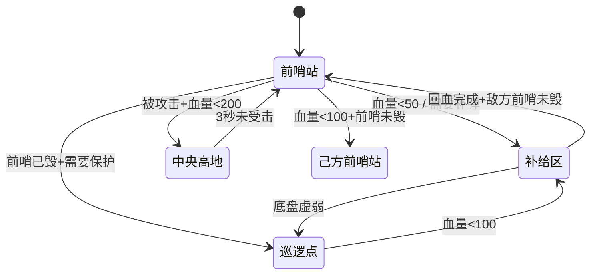

# 哨兵机器人全栈控制系统

> **RoboMaster 全国赛** ― 哨兵机器人完整嵌入式固件  
> 底盘运动 + 双云台控制 + 导航决策，三块 STM32F407 通过 CAN 总线协同

---

## ? 系统架构

```
┌──────────────────────────────────────────────────────────────────┐
│                        哨兵机器人                                 │
│                                                                   │
│  ┌────────────────┐  ┌──────────────────┐  ┌──────────────────┐ │
│  │  steer_chassis │  │  大yaw_感知相机   │  │ 小头儿子_感知相机 │ │
│  │   底盘舵轮控制  │  │  导航决策+大云台  │  │  小云台+射击控制  │ │
│  │   (STM32F407)  │  │   (STM32F407)    │  │   (STM32F407)    │ │
│  └───────┬────────┘  └───────┬──────────┘  └───────┬──────────┘ │
│          │                   │                      │            │
│          └─────────┬─────────┴──────────┬───────────┘            │
│                    │     CAN Bus        │                        │
│          ┌─────────┴─────────┐  ┌───────┴───────────┐           │
│          │ 4×M3508 底盘电机  │  │ 4×6020 舵机电机    │           │
│          │ 2×3508 摩擦轮     │  │ 2×6020 Yaw/Pitch  │           │
│          └───────────────────┘  └───────────────────┘           │
│                                                                   │
│  通信链路: USB虚拟串口 ? 迷你PC | 串口 ? 裁判系统 | CAN ? 超电   │
└──────────────────────────────────────────────────────────────────┘
```

---

## ? 工程一：`steer_chassis` ― 底盘舵轮运动控制

### 职责
全向舵轮底盘运动学解算、PID 控制、功率限制、里程计观测、上位机通信

### 硬件
| 组件 | 型号 | 数量 | 说明 |
|------|------|------|------|
| 主控 | STM32F407IGHx | 1 | ARM Cortex-M4 @ 168MHz |
| 底盘电机 | M3508 | 4 | 直流无刷，减速比 19.2:1 |
| 舵机电机 | 6020 | 4 | 直流无刷，编码器 8192 线 |
| 超电 | 超级电容 | 1 | 功率缓冲，CAN 通信 |

### 控制流水线 (1ms 周期)
```
[1] 坐标系旋转   → RotateSpeedToBase()           云台系 → 底盘系
[2] 逆运动学分解 → chassis_speed_get()             vx/vy/ω → 四轮分量
[3] 舵角解算     → steer_angle_get()              atan2 + 劣弧优化
[4] 速度合成修正 → chassis_speed_set()             方向修正 + cos?衰减
[5] PID 级联计算 → chassis_clac()                 位置环→速度环→电流环
[6] 功率限制     → chassis_power_limit_set()      超电自适应分配
```

### 核心源文件
| 文件 | 行数 | 功能 |
|------|------|------|
| `branch/sentry_chassis.c/h` | ~660 | 运动控制核心：坐标系旋转、逆运动学、舵角解算、功率限制 |
| `branch/system.c/h` | ~410 | 系统任务、模式调度、云台-底盘夹角解算、离线检测 |
| `branch/Odometer.c/h` | ~460 | 里程计观测器：线性卡尔曼滤波 + RMS 自适应打滑检测 |
| `branch/motor.c/h` | ~90 | 电机 CAN 通信（正常/错误帧切换） |
| `branch/SuperCAP.c/h` | - | 超级电容充放电管理 |
| `bsp/boards/bsp_transmit.c/h` | ~100 | 串口协议：上位机指令解析 + 状态回传 |
| `bsp/boards/bsp_pid.c/h` | - | 通用 PID 控制器 |

---

## ? 工程二：`大yaw_感知相机` ― 导航决策 + 视觉云台

### 职责
哨兵自主导航决策、大Yaw轴云台控制、视觉追踪、裁判系统交互、迷你PC通信

### 决策模式 (6 种)
| 模式 | 遥控器组合 | 行为 |
|------|-----------|------|
| `extreme` (激进) | S_L=1, S_R=1 | 打前哨站 + 上敌方堡垒 + 保护己方基地 |
| `conservative` (保守) | S_L=3, S_R=3 | 飞坡打前哨站 + 守堡垒 |
| `patrol` (巡逻) | S_L=3, S_R=1 | 只打前哨站，不上敌方高地 |
| `flying` (飞坡) | S_L=3, S_R=2 | 飞坡落点 + 打前哨站 |
| `protect` (保护) | S_L=1, S_R=3 | 守飞坡 + 前哨站保护 |
| `air_control` (云台手) | 上位机标点 | 云端手远程操控 |

### 核心源文件
| 文件 | 行数 | 功能 |
|------|------|------|
| `branch/decision.c/h` | ~750 | 哨兵电控决策：6 模式状态机 + 裁判系统交互 + 击打决策 |
| `branch/gimbal_big_yaw.c/h` | ~230 | 大Yaw云台：遥控/巡航/视觉 三模式 + 限位检测 |
| `branch/navigation.c/h` | ~70 | 导航通信：USB虚拟串口收发 + 坐标系转换 |
| `branch/system.c/h` | ~140 | 系统任务：遥控/自动模式切换 + 底盘速度设定 |
| `branch/chassis_control.c/h` | - | 底盘控制指令生成 |
| `branch/omni.c/h` | - | 全向移动解算 |

### 决策状态机示例 (extreme 模式)


---

## ? 工程三：`小头儿子_感知相机` ― 小云台 + 射击控制

### 职责
小云台 Yaw/Pitch 双轴 PID 控制、摩擦轮射击（射速自适应 + 温度补偿）、视觉自瞄联动

### 云台模式
| 模式 | 说明 |
|------|------|
| `small_gimbal_off` | 关闭，电流清零 |
| `small_gimbal_rc` | 遥控器控制 |
| `small_gimbal_pc` | PC 视觉自瞄（巡航 / 视觉追踪） |

### 核心源文件
| 文件 | 行数 | 功能 |
|------|------|------|
| `small_gimbal_2/branch/gimbal.c/h` | ~500 | 小云台 Yaw/Pitch 双轴级联 PID + 视觉巡航 |
| `small_gimbal_2/branch/shoot.c/h` | ~180 | 摩擦轮射击：射速自适应 + 温度补偿 + 转速PID |
| `small_gimbal_2/branch/system.c/h` | ~150 | 通信检测 + 视觉重置 + 离线检测任务 |
| `small_gimbal_2/branch/trig.c/h` | - | 三角函数快速计算 |
| `small_gimbal_2/branch/motor.c/h` | - | 电机 CAN 通信 |

---

## ? 编译与烧录

| 项目 | IDE | 编译器 | 目标芯片 |
|------|-----|--------|----------|
| 全部 | Keil MDK-ARM V5 | ARM Compiler V5.06u7 | STM32F407IGHx |

### 编译步骤
1. 打开各工程目录下的 `MDK-ARM/infantry_25.uvprojx`
2. 选择 Target: `infantry_25`
3. Build (F7)

---

## ? 分支说明

| 分支 | 说明 |
|------|------|
| `main` | 原始比赛代码 |
| `zc_withai` | **AI 辅助优化版** ― 代码美化 + 逻辑重构 + 消除全部警告 |

---

## ? `zc_withai` 优化记录

### 底盘工程 (`steer_chassis`)

| 文件 | 改动 | 效果 |
|------|------|------|
| `sentry_chassis.c` | 提取 4 个公共函数：`RotateSpeedToBase` / `CalcMotorPower` / `ApplyPowerLimit` / `ResolveSteerShortArc` | 消除 ~200 行重复，功率限制引擎舵机/底盘共用 |
| `system.c` | `get_diff_angle` 40行→10行，`NormAngle` 归一化 | 逻辑简洁，消除 double 常量 |
| `Odometer.c` | 补充 `Odometer_run` 任务、`#include "string.h"` | 修复编译错误 |
| 全部头文件 | Doxygen 注释、`(void)` 规范化、移除弃用声明 | 49→0 Warning |
| `bsp_transmit.c` | 修复 `location` 未定义、美化格式 | 编译通过 |

### 大Yaw工程 (`大yaw_感知相机`)

| 文件 | 改动 | 效果 |
|------|------|------|
| `decision.c` | **修复模式分发**：`decision_point_chose` 硬编码测试→6模式 switch | 决策模式现在正确路由 |
| `gimbal_big_yaw.c` | 全面重构，移除 6 个调试变量 | 230 行清晰结构 |
| `system.c` | 全面重写 280→144 行 | 移除死代码 |
| `navigation.c` | 清理重写 | 移除 8 个调试变量 |

### 小云台工程 (`小头儿子_感知相机`)

| 文件 | 改动 | 效果 |
|------|------|------|
| `system.c` | 全面重写 | 移除 8 个调试变量，清理 200+ 行 |
| `shoot.c` | 格式化 + 清理 | 移除 `ioijij`/`bbbbb` 等调试变量 |

### ? 整体统计
- **净删除**: ~1,500 行死代码 / 调试变量 / 重复逻辑
- **警告消除**: 从 49 Warning → 0 Warning（底盘工程）
- **函数提取**: 新增 8 个公共辅助函数
